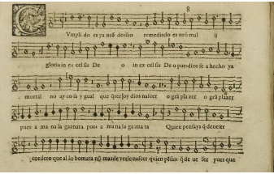

{width=15%}\

__Telf__: +33678317676

__Correo__: <nramila@ucm.es>

__Linkedin__: [https://www.linkedin.com/in/noemi-ramila-diaz-7b577054/](https://www.linkedin.com/in/noemi-ramila-diaz-7b577054/)

[Aquí][academia] mis publicaciones

[Aquí][academia] mis comunicaciones

***

# GUION DE PRÁCTICAS

## Micro-curso música española del Renacimiento

>Como trabajo final de este micro-curso sobre música española del Renacimiento, se deberá elaborar una mini-memoria. Esta estará formada por un tema elegido por el alumno en el que debe desarrollar un aspecto tratado en la lección.

***

# Realización

## Pasos a seguir

Los pasos a seguir son como se enumera a continuación:

1.	En primer lugar, visionar todos los documentos.

	-	Se aconseja tomar nota al mismo tiempo del visionado

2.	Elegir un tema a tratar.

	-	El alumno escoge una temática que le haya resultado interesante

3.	Realizar una investigación preliminar.

4.	Escribir un resumen de 3 páginas sobre los aspectos principales.

# Envío

## Pasos a seguir

Enviar una copia en formato .docx y .pdf a [mi dirección](mailto:nramila@ucm.es)

En el correo se debe indicar:

-	El nombre y apellido del alumno
-	El grupo al que pertenece el alumno
-	La asignatura

[academia]: https://u-paris10.academia.edu/NoemiRAMILADIAZ "arti-comu"